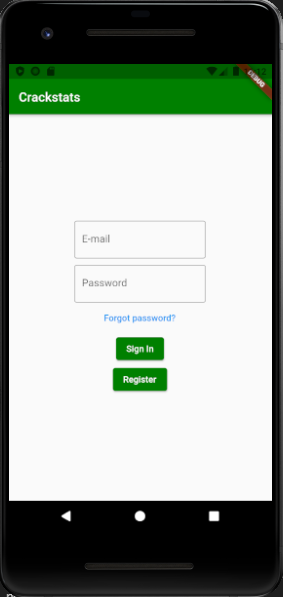
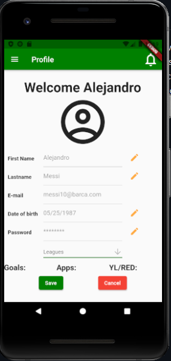

# CrackStats
Repository for CrackStats

## Introduction
The mobile application provides a system to manage soccer leagues. Each player, team owner or league owner needs to create a profile, which includes a password that is encrypted by the system. The profile will have stored the user information, stats, teams, leagues and administrative permissions. The system is self-sustainable, each player requests permission to be added to the team, which is accepted/rejected by the team owner and in the same manner, each time a team wants to be created, it requests permission to a league to be added to it. Leagues are created by application admins. All the information (stats, schedule, team, players, data, etc) is stored in a database. 

  
 

  

## Technologies
### Languages
-Dart 
-Php 
### Frameworks
-Flutter 
### Libraries
-dart:convert  
-flutter/material.dart 
-crypto/crypto.dart 
-collection/collection.dart 
-http/http.dart 
-mailer/mailer.dart 
-mailer/smtp_server.dart 

## Prerequisites
OS: Jelly Bean, v16, 4.1.x or newer 
Mobile hardware: ARM Android devices.
    
## Installation
For installing the system just download the app from playstore

## Description
### Context
We participate in a few soccer leagues from our respective citys and found a problem at the administration and management of them. Found that those amateurs soccer leagues do not have a application that will assit them to administrate their leagues. The local leagues use social media apps to administrate their leagues by updating their schedule, stats, and standings in there.
Created this app to help those local leagues to administrate their tournament in a way where they can reduce significally the user input required. This app will help the league as well as the user, since the app was develop not only for the league but for the pllayers aswell.
		
### What can the project specifically do
The app from the user side can store his perfomances from each game. Help the player to keep track of his personal stats as goal scored, matches played, and diciplinary stats.  Facilitate the way they register to the league and team by just sending a request to the owner of the team and league administrator. The app requires to create a password which is encrypted for security to access the player profile.
Update the stadistics, schedule, player information and team information. Get rid of the paper work and manually modify the league information. Crackstats also include a notifications section where the player can see league notifications and the league can see player requests which improve the communication between the league and players.

### Features
#### Player
-Create a profile with his password encrypted for security 
#### Team
-
#### League
-
#### Administrator
-
	
### Links
Demo Link: 

## Usage
This app is used for the management of a soccer league. Automatice the complexity of administrate a soccer league.

## Support
For any questions, do not hesistate to contact the authors.

## Roadmap
In the future, we will add the profile picture and push notifications

## Authors and Acknowledgements
Hugo Ocon - oconhugo14@gmail.com   Alejandro Ibarra Polanco - alejandro.ibarra.p@gmail.com 

## Project Status
Complete
